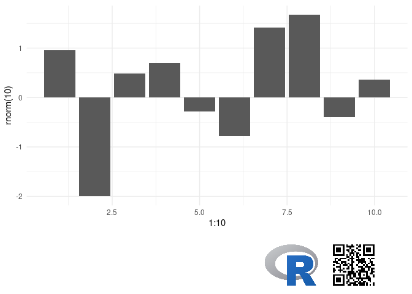

<!-- README.md is generated from README.Rmd. Please edit that file -->

# ggtrack

<!-- badges: start -->

[](https://lifecycle.r-lib.org/articles/stages.html#experimental)
<!-- badges: end -->

Sometimes in a workplace it is hard to know exactly where or when a
specific chart has been produced. This is especially true when someone
has copied a chart out of a report to use somewhere else. The `ggtrack`
package aims to solve this problem by embedding enough metadata in the
charts image to identify the source and the exact time it was produced.

The metadata is added by way of a QR code embedded in a chart “tracking”
footer. The QR code can encode any arbitrary text and will append a time
stamp. The text is intended to be a URL or a unique id for the original
document or chart source.

QR codes can then be scanned using a phone scanner or the [quadrangle
package](https://github.com/brianwdavis/quadrangle).

The `ggtrack` footer can also display a corporate logo and additional
text.

## Installation

You can install the latest version of project from
[Github](https://github.com) with:

``` r
devtools::install_github("mrjoh3/ggtrack")
```

## Example

To start you just need a `ggplot` and some text you wish to encode

``` r
library(ggtrack)
library(ggplot2)

gg <- ggplot(mapping = aes(x = 1:10, y = rnorm(10))) +
  geom_bar(stat = 'identity') +
  theme_minimal()

ggtrack(gg,
        qr_content = 'Report ID: 2c9075a5-4d7e-47a5-8616-55dd88af3dc5')
```


### Add a Logo

<style>
.hide img {
  float: right;
  margin-bottom: -50%; /* crop position */
}
</style>

<div class="hide">

``` r

  ggtrack(gg,
        qr_content = 'text content here',
        logo = 'https://www.r-project.org/logo/Rlogo.png')
```



</div>
